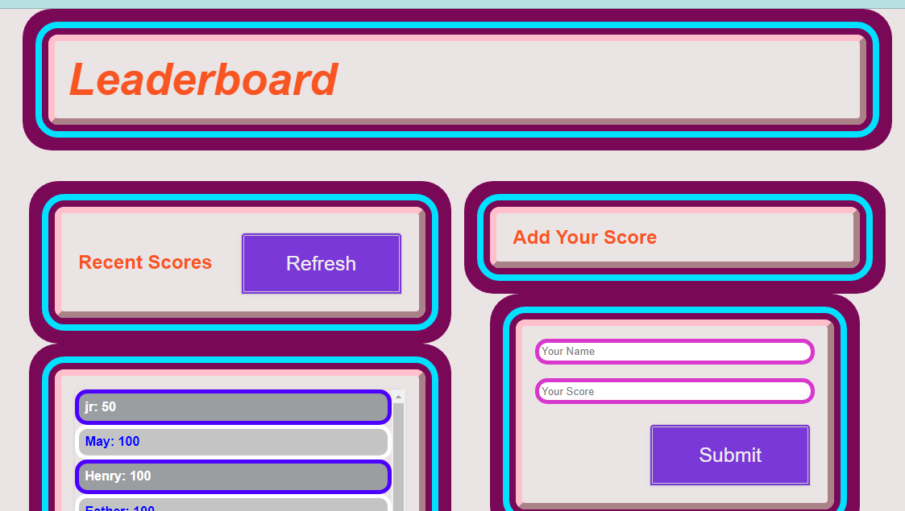

# 📗 Table of Contents

- [📖 About the Project](#about-project)
  - [🛠 Built With](#built-with)
    - [Key Features](#key-features)
- [💻 Getting Started](#getting-started)
  - [Setup](#setup)
  - [Prerequisites](#prerequisites)
  - [Install](#install)
  - [Usage](#usage)
  - [Run tests](#run-tests)
  - [Deployment](#triangular_flag_on_post-deployment)
- [👥 Authors](#authors)
- [🔭 Future Features](#future-features)
- [🤝 Contributing](#contributing)
- [⭐️ Show your support](#support)
- [🙏 Acknowledgements](#acknowledgements)
- [📝 License](#license)

# 📖 Leaderboard
 

# Leaderboard
The leaderboard website displays scores submitted by different players. It also allows you to submit your score. All data is preserved thanks to the external Leaderboard API service This is built using ES6 and Webpack!

**Live Demo**

## 🛠 Built With 
- JavaScript
- HTML
- CSS
- Webpack
- Visual Studio Code
- Git & Github

(<a href="#readme-top">back to top</a>)

## 💻 Getting Started 
To get a local copy up and running follow these simple example steps.
- Open terminal
- Clone this project by the command `git clone https://github.com/mumo-esther/Leaderboard.git`
- `cd <clone>` folder
- Run `npm start` in your local browser or using Live Server in Visual Studio Code.

### Prerequisites

- IDE to edit and run the code (We use Visual Studio Code 🔥).
- [Node.js](https://nodejs.org/en/download/) already downloaded.
- Webpack - [click here to getting started](https://webpack.js.org/guides/getting-started/).

### Setup

Clone this repository to your desired folder:
  cd my-folder
  git clone https://github.com/mumo-esther/Leaderboard.git

### Run tests

To run tests, run the following command:
  - npx hint .
  - npx eslint .

  ### Key Features
- Leaderboard page structure
- Sending and fetching data from the Leaderboard API services
 
  

(<a href="#readme-top">back to top</a>)

## 👥 Authors 

👤 **Esther Mawioo**

 - [Github](https://github.com/mumo-esther/mumo-esther)
 - [Linkedin](https://www.linkedin.com/in/esther-mawioo-58b636225/)
 - [Twitter](https://twitter.com/EstherMawioo)

(<a href="#readme-top">back to top</a>)

## 🤝 Contributing 

Contributions, issues, and feature requests are welcome!

(<a href="#readme-top">back to top</a>)

## ⭐️ Show your support 

If you like this project you can give it a ⭐️.

(<a href="#readme-top">back to top</a>)

## 🙏 Acknowledgments 
- Hat tip to anyone whose code was used 🔰
- Inspiration 💘
- Microverse program ⚡
- My standup team 🏹
- My family's support 🙌

(<a href="#readme-top">back to top</a>)

## 📝 License 

This project is [MIT](./LICENSE) licensed.

